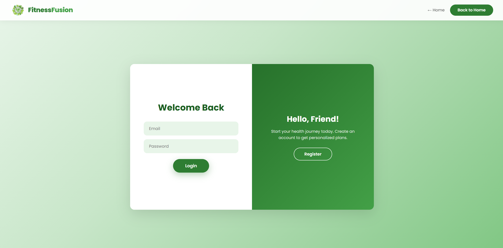
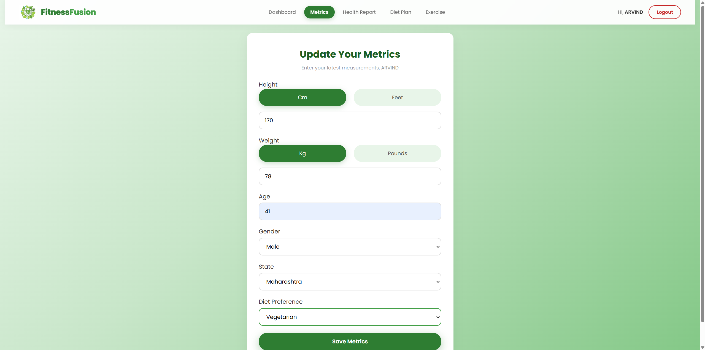
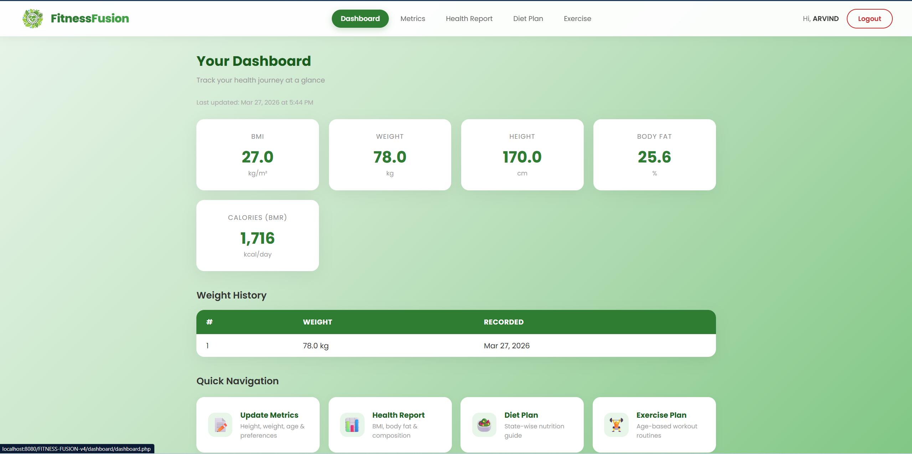
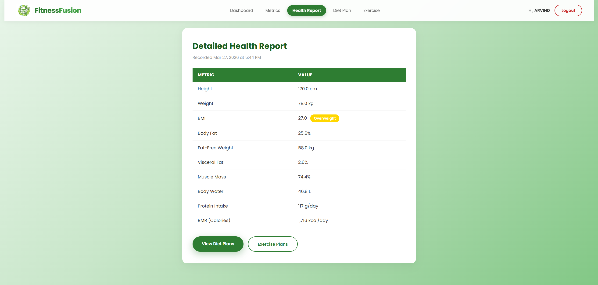
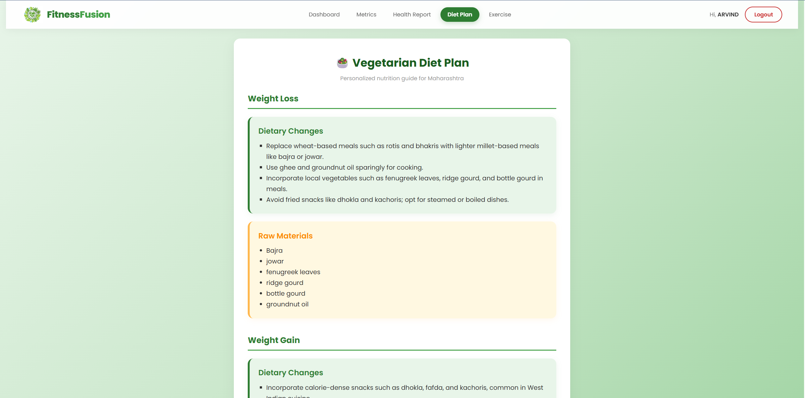
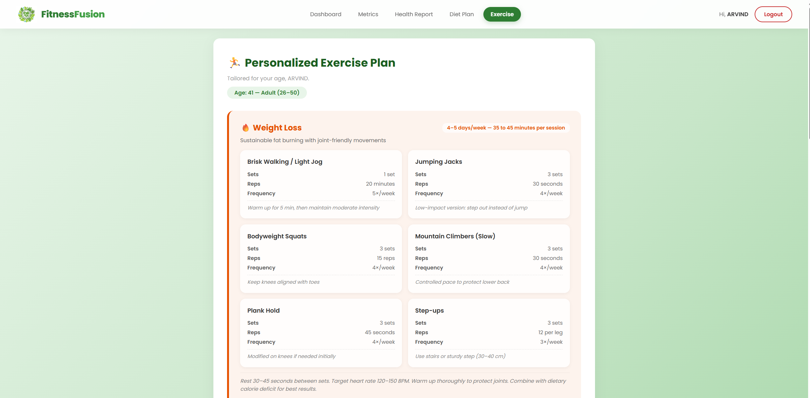

# 🧘‍♂️ FITNESS FUSION

A full-stack health and fitness web application for tracking personal health metrics, generating insights, and providing personalized diet and exercise guidance.

---

## 🚀 Overview

Fitness Fusion is a PHP + MySQL web application that enables users to register, track health metrics, and visualize progress through an interactive dashboard. It simplifies fitness tracking with structured data input and clear visual insights.

---

## ✨ Features

- 📊 Health Metrics Dashboard (BMI, Body Fat %, BMR, calories)
- 📈 Weight History Tracking
- 🥗 State-wise Diet Plans (Veg & Non-Veg)
- 🏋️ Age-based Exercise Plans
- 🔐 Secure Authentication (bcrypt, session protection)
- 📱 Responsive UI (mobile + desktop)

---

## 🏗️ System Workflow

User → Browser (HTML/CSS/JS) → PHP Backend (validation & logic) → MySQL Database → Dashboard & Reports

---

## 🛠️ Tech Stack

- Backend: PHP 8.x  
- Frontend: HTML, CSS, JavaScript  
- Database: MySQL  
- Server: Apache (XAMPP)

---

## 📸 Screenshots

## 📸 Screenshots

### 🏠 Home Page


### 🔐 Login Page


### ➕ Update Metrics


### 📊 Dashboard


### 📄 Health Report


### 🥗 Diet Plan


### 🏋️ Exercise Plan


---

## 🚀 Installation & Setup

### Prerequisites
- XAMPP / WAMP (PHP, MySQL)
- Git

### Steps

```bash
git clone https://github.com/HP0077/FITNESS-FUSION-V4.git
